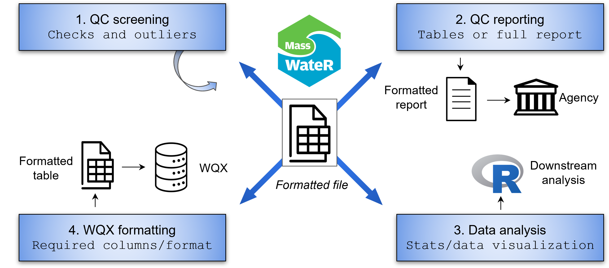

```{r setup, include=FALSE}
knitr::opts_chunk$set(echo = FALSE, warning = FALSE, message = FALSE)

library(flextable)
library(dplyr)
library(here)

flextable::set_flextable_defaults(font.size = 7, padding = 0)

load(file = here('tabs/filerequirements.RData'))
```

# Introduction

Water quality measurements provide the foundation of environmental monitoring programs designed to protect or restore aquatic resources. In the United States, these programs are broadly guided by the federal Clean Water Act with the singular goal of restoring and maintaining the chemical, physical, and biological integrity of the nation's surface waters.  Similarly, the Water Framework Directive provides a framework for the protection of aquatic resources in member states of the European Union.  Numeric standards that define critical thresholds for protecting recreational, aquatic life, industrial, navigational, and consumptive uses of the resource are often established, that, if exceeded based on water quality measurements, require additional regulatory action to ensure compliance. These standards and other regulatory assessments as applied at the state-level use information from long-term monitoring datasets [@Schiff16; @Tango13], or data collected *ad hoc* from multiple assessment endpoints [@Stein09; @Behmel16; @Kumpel20], where the former is atypical for most surface water bodies.  Many state or regional institutions that assess water quality rely on decentralized data sources, often combining datasets from local watershed groups or participatory science programs rather than a single database that contains adequate coverage of all areas of interest [@Buytaert14; @Kelly22]. Use of these monitoring data in a regulatory context is not possible unless standard operating procedures are adopted and the data fulfill quality control (QC) requirements.   

Monitoring data of sufficient quantity and quality are critical to ensure precise and accurate representation of environmental conditions.  A significant bottleneck in the use of monitoring data for environmental assessment of surface waters is the ability to clearly and efficiently indicate that the data fulfill applicable QC checks for regulatory applications or inclusion in a consolidated database [@Arndt22]. Common QC checks for *in situ* field measurements or concentrations measured in the laboratory may include 1) comparison of the precision between replicate samples (duplicates), 2) comparison of a sample to a known concentration (spikes or instrument checks), and 3) precision of the measurement from an empty or blank sample (blanks) [@Wilde02].  An adequate number of QC samples must also be included in the dataset as a measure of "completeness".  These checks are often compiled in a single report for review by appropriate regulatory agencies.  For example, precision of duplicate samples for a given parameter must not vary more than 5% and at least 10% of the data should be dedicated to these checks as a measure of completeness. For local monitoring groups that lack the resources to develop robust and repeatable workflows, QC reports are often prepared manually before submitting the data for review.  This process is time-consuming and prone to errors, often limiting the amount of useful information for regulatory assessments or submitted to formal databases.  

The use of R with document generation systems offered through packages like \CRANpkg{knitr} [@Xie15] and \CRANpkg{rmarkdown} [@Allaire23] can generate QC reports that follow a standard format for review by regulatory agencies.  These tools can also be used to format water quality data for submission to state or national water quality databases, such as the Water Quality Exchange (WQX) database maintained by the US Environmental Protection Agency (USEPA).  This database is the largest source of monitoring data in the United States that includes information on hydrologic conditions and chemical, physical, and biological measurements from surface waters.  Further, many environmental resource managers have the need to analyze status and trends in monitoring data and R packages such as \CRANpkg{ggplot2} [@Wickham16] and others in the \CRANpkg{tidyverse} [@Wickham19] offer useful tools to synthesize and visualize results. Integrating this functionality into a single package is expected to have wide ranging utility for anyone collecting surface water data and is likely to improve the quality and insights obtained from these data.  

This paper describes the \CRANpkg{MassWateR} package developed to improve how environmental professionals perform quality control, analysis, and sharing of monitoring data for surface waters.  The regional focus of the package is for monitoring data collected in Massachusetts, USA, with QC reports submitted to the Massachusetts Department of Environmental Protection (MADEP) and data submitted to the national WQX database.  Although the initial conception of \CRANpkg{MassWateR} was to address regional needs in Massachusetts, there is nothing specific in the package that prevents its use outside of the state as the QC checks and analyses follow routine and commonly used methods for data collected elsewhere.  As such, this paper is written with emphasis on how the tools are broadly applicable to anyone interested in improving efficiency and reproducibility of QC checks, in addition to analysis of water quality data and submission to WQX as the largest source of water quality monitoring data in the US.  

# Requirements for using \CRANpkg{MassWateR}

To our knowledge, there are no existing R packages on CRAN that can be used to facilitate QC of water quality data, nor are any available that facilitate submission to existing databases.  However, there are several that can be used to retrieve and analysis data from existing sources (see the CRAN \ctv{Hydrology} Task View).  In particular, the \CRANpkg{dataRetrieval} package [@DeCicco22] has been used widely to retrieve data from the USEPA Water Quality Portal (WQP), which is the counterpart of the WQX system for accessing data submitted using the latter.  This package leverages a robust API to query existing water quality data in standardized format provided by the WQP.  As such, data retrieval using existing web services is much simpler than data submission, as data formatting requirements do not apply when retrieving data.  Developing a robust tool that can facilitate the upload of data to WQX, in addition to streamlining QC processes, would further the value of packages like \CRANpkg{dataRetrieval} by increasing the amount of data that can be accessed through the WQP.  The \CRANpkg{MassWateR} package was developed to provide this benefit.

Users can engage with \CRANpkg{MassWateR} to achieve different goals.  This design was intentional based on likely differences in needs among the user community.  Although increasing data submission and facilitating QC reporting was the primary goal, we also assumed that users may not want to do both.  That is, QC reporting is not a requirement to submit to WQX, whereas state institutions require this reporting for regulatory assessment.  Users may also simply have a need to understand trends or to summarize their data, while also wanting to extend these analyses beyond \CRANpkg{MassWateR} using additional R packages. Figure \@ref(fig:workflow) demonstrates how a user may apply the functions in \CRANpkg{MassWateR} once the required data are imported.  The functions allow a user to engage with their data several ways, including 1) screening data for quality control, 2) summarizing quality control results into a single report or separate tables, 3) creating graphics for analysis and reports to stakeholders, and 4) formatting data for upload to WQX.    

```{r workflow, fig.cap = 'Workflow demonstrating how a user could engage with the \\CRANpkg{MassWateR} package.  A user can apply one to any of the four steps depending on their need.  The first step, QC screening, is often iterative as a user can modify parts of the raw data based on input checks or outliers.  The second step can be used to create a QC report for submission to a regulatory agency.  The third step can create a formatted table for WQX submission.  The fourth step is data analysis and visualization, using \\CRANpkg{MassWateR} functions and downstream analysis with additional R packages and functions.  All steps require formatted input files.  WQX: Water Quality Exchange; QC: Quality Control.', fig.alt='Workflow diagram showing four ways to engage with MassWateR', out.width='100%'}

```

No matter the user need, all data inputs to \CRANpkg{MassWateR} must follow a strict format.  Developing a workflow to accommodate data inputs from the dozens of potential users from different organizations that use different data formats would have been impractical.  As such, the only limitation to using the package is to adhere to the formatting requirements for all input files.  Several [resources](https://massbays-tech.github.io/MassWateR/RESOURCES.html) are provided on the package web page to assist users in formatting their data.  These resources included several training activities that were conducted during package development and templates demonstrating the appropriate format and rationale.

The required data files for using \CRANpkg{MassWateR} are shown in Table \@ref(tab:filreq), including the files that apply to the workflow steps in Figure \@ref(fig:workflow).  The files are each imported into R using specific `read` functions with relevant checks, explained in the next section.  These checks verify multiple requirements outlined in the template files, with informative errors or warnings returned to the console to prompt the user on the required action to remedy a formatting issue.  The largest input file required for all parts of the workflow in Figure \@ref(fig:workflow) is the results file.  This file includes all water quality monitoring data to be used with the package. As such, the formatting requirements for the results file are the most burdensome for potential users and additional functions are available to assist in this effort.

```{r filreq}
filerequirements %>% fontsize(part = 'all', size = 9)
```

The following sections describe the basic approach to using functions in \CRANpkg{MassWateR} for any of the processes in the workflow.  The naming convention for the functions is meant to provide users with an intuitive format for understanding what each function does and the step of the workflow for which the function applies.  Although there are some exceptions to this nomenclature, the general format includes a prefix for each function as follows.  Each prefix also includes `MWR` to avoid namespace conflicts with other packages (e.g., `readMWR`).  

* `read`: Read input files
* `check`: Check input files for formatting issues, used internally to the read functions 
* `form`: Format input files for downstream functions, used internally to the read functions once the checks have passed
* `anlz`: Analyze imported data
* `tab`: Create formatted tables for QC analysis
* `qc`: QC functions for summarizing QC results, used internally to the table functions
* `util`: Various utility functions that accomplish routine tasks, possibly useful as standalone functions

Additionally, functions may often include a suffix that describes the relevant file used as input or otherwise evaluated in a downstream function.

* `results`: The results input file
* `acc`: The data quality objectives file for accuracy
* `frecom`: The data quality objectives file for frequency and completeness
* `sites`: The site metadata file
* `wqx`: The WQX metadata file

# \CRANpkg{MassWateR} functions

## Read and check files

The primary task of the `read` functions is to ensure all imported files follow the required format for the package.  Excel files are the expected format for all inputs and the `read` functions use the `read_excel` function from the \CRANpkg{readxl} package [@Wickham23]. The `read` functions do very little other than import the file - once the file is imported it is immediately passed to one of the relevant `check` functions inside the `read` function.  There are several checks for each type of input file, with the number of checks increasing based on the complexity of the input file.  Each check is printed to the R console on completion, whereas an error is returned at the first instance of a failed check, at which point the function is exited.  The error will typically indicate which parts of the input file need to be changed to rectify the issue, often indicating a specific cell in the Excel file that requires attention. As such, the workflow is intended to be iterative, where a user imports a file, receives an error, manually changes the input file in Excel, then imports the data again until all checks pass (Figure \@ref(fig:importflow)).  Again, this design was intentional as many monitoring agencies and groups collect data differently and a standard input format for the package was the best option to accommodate all potential users.  This may also encourage future standardization among monitoring groups for how data are maintained to ease formatting challenges to using \CRANpkg{MassWateR}. A user only needs to format their data once to use the package. 

```{r importflow, fig.cap = 'Pseudocode demonstrating the iterative process of importing a required data file for \\CRANpkg{MassWateR}.  All read functions import an Excel file and the imported file is then passed to a check function.  The function exits if an error is encountered, allowing the user to manually fix the identified error and then import again.  After all checks are passed, a formatting function is applied to correct minor issues (e.g., standardize date format as YYYY-MM-DD) and the final data object is returned (e.g., `resdat`).', fig.alt='Diagram showing pseudocode for importing and fixing a data file with MassWateR', out.width='100%'}
knitr::include_graphics('figs/importflow.png')
```

A correctly formatted input file would be imported as follows, with the messages in the console indicating the checks that were performed and that all checks were successful.  Below demonstrates what would be shown for the results file using an example dataset included with the package.  A total of fifteen checks are applied to the results file. 

```{r, echo = T, message = T}
library(MassWateR)

# import results data
respth <- system.file("extdata/ExampleResults.xlsx", package = "MassWateR")
resdat <- readMWRresults(respth)
```

The following shows a typical error that might be returned if a check fails when importing the results file.  The `resdat` object is an imported results file that has passed all checks, but incorrect entries are added to the `chk` object to demonstrate the error that is returned if a user would have attempted to import this file.  The `checkMWRresults()` function is run inside the `readMWRresults()` function and runs the checks (e.g., the column names are correct, all required columns are present, activity types are valid, etc.), but then stops when invalid activity types in the `Activity Type` column are found.  In this example, a user would need to change the entries in rows 4 and 135 of the `Activity Type` column in their Excel file to fix the issue and import the file again as in Figure \@ref(fig:importflow).  The online [vignette](https://massbays-tech.github.io/MassWateR/articles/inputs.html#data-import-and-checks) specifies the valid entries. 

```{r, error = T, echo = T, message = T}
chk <- resdat
chk[4, 2] <- "Sample"
chk[135, 2] <- "Field"
checkMWRresults(chk)
```

The `readMWRresultsview()` function is also available to assist with troubleshooting formatting issues for the results file.  This function exports an Excel file that shows the unique values that are found in each column to allow a user to quickly see potential incorrect entries.  The output is similar to running `apply(resdat, 2, unique)` in the console, but an external file is created that users may be more comfortable evaluating to troubleshoot formatting problems.  

After all file format checks are fixed, a standard approach for using \CRANpkg{MassWateR} is to import all required files and save them as a list of named data frame objects that can be used by nearly all the package functions.  This prevents the need to identify which input datasets are needed for each function, although the latter approach could used because arguments for individual input files are also provided in all functions.  In the latter case, a path or data object can be used as input for each file. For the former approach, the beginning of a script for using the package could appear as follows.  Example files included with the package are imported, whereas a user will specify paths to their own files.   

```{r, results = 'hide', echo = T}
# import results data
respth <- system.file("extdata/ExampleResults.xlsx", package = "MassWateR")
resdat <- readMWRresults(respth)

# import accuracy data
accpth <- system.file("extdata/ExampleDQOAccuracy.xlsx", package = "MassWateR")
accdat <- readMWRacc(accpth)

# import frequency and completeness data
frecompth <- system.file("extdata/ExampleDQOFrequencyCompleteness.xlsx", package = "MassWateR")
frecomdat <- readMWRfrecom(frecompth)

# import site data
sitpth <- system.file("extdata/ExampleSites.xlsx", package = "MassWateR")
sitdat <- readMWRsites(sitpth)

# import WQX metadata
wqxpth <- system.file("extdata/ExampleWQX.xlsx", package = "MassWateR")
wqxdat <- readMWRwqx(wqxpth)

# a list of input data frames
fsetls <- list(res = resdat, acc = accdat, frecom = frecomdat, sit = sitdat, wqx = wqxdat)
```

The object `fsetls` can then be used as input to downstream functions.

A final note about the data inputs is that many types of water quality measurements can be included for analysis, although the package is currently limited to working with discrete samples as compared to data from continuous monitoring equipment.  The `paramsMWR` dataset included with \CRANpkg{MassWateR} provides a complete table of the parameters that can be used with the package.  On data import, this dataset is referenced to ensure that only relevant parameters are included and that appropriate units of measurement are provided.  The dataset includes `r nrow(paramsMWR)` different parameters, each with multiple valid units of measurement.  Additionally, only one unit of measurement is allowed per parameter, which was an intentional design so that tedious functions for converting between dozens of units of measurement did not need to be created during package development.  It is not an unreasonable expectation for users to provide only one unit of measurement per parameter.  Laboratories typically have a standard reporting format based on the same methodology or instrument used to measure concentrations of water quality parameters.   

An additional set of functions can be used to check for outliers in the results file.  Outliers can be caused by several reasons, including data entry errors, laboratory processing errors, or anomalous environmental events.  Identifying and potentially removing or correcting outliers is a critical part of quality control.  The functions in \CRANpkg{MassWateR} simply identify potential outliers to provide an opportunity for users to address these values.  The decision on how to address outliers remains with the user and no automated tools are provided in the package to correct or remove outliers.  

The `anlzMWRoutlier()` function uses the results file and data quality objectives for accuracy to plot potential outliers for a parameter by month.  The accuracy file is used to automatically identify the y-axis scaling (as arithmetic or log) and to replace concentrations with appropriate values for those labelled as beyond detection. Outliers are defined using the standard definition of 1.5 times the interquartile range (the 25th to 75th percentile) of a parameter and can be visually identified as points above or below the whiskers in the boxplots.  The station name for a point is also shown.  The `param` argument specifies the water quality parameter to evaluate and the `group` argument specifies how the boxplots are grouped (by year, month, week, or station).  In the following example, three stations are identified as potential outliers for the respective month.

```{r, fig.height = 4, fig.width = 8, echo = T, out.width = '95%', fig.align = 'center'}
anlzMWRoutlier(fset = fsetls, param = "DO", group = "month")
```

The outliers in the above plot can also be viewed as tabular output using `outliers = TRUE` to aid in their identification. 

```{r, echo = T}
anlzMWRoutlier(fset = fsetls, param = "DO", group = "month", 
  outliers = TRUE)
```

A user can also evaluate outliers for every water quality parameter in the results file.  The `anlzMWRoutlierall()` function creates a Word document with images of boxplots for every parameter.  Images for each parameter can also be created as standalone files.  The `param` argument does not need to be specified because all parameters are identified in the results file and processed accordingly.  The following shows how to use the function by creating a single Word file or individual image files in the working directory.

```{r, echo = T, eval = F}
# create word output
anlzMWRoutlierall(fset = fsetls, group = 'month', format = 'word', 
  output_dir = getwd())

# create png output
anlzMWRoutlierall(fset = fsetls, group = 'month', format = 'png', 
  output_dir = getwd())
```

As in Figure \@ref(fig:importflow), a user can identify outliers from the results, modify the file in Excel, and import the file again for further QC reporting or analysis. 

## Quality Control reporting

The quality control functions in \CRANpkg{MassWateR} are designed to create a single report that compares the water quality data in the results file (`resdat`) to data quality objectives in the accuracy (`accdat`) and frequency and completeness (`frecomdat`) files.  In general, the QC checks for accuracy evaluate if laboratory and field duplicates, blanks, or spikes are within acceptable ranges.  The QC checks for frequency and completeness evaluate if a sufficient number of records in the results file satisfy the accuracy checks and that sufficient QC data have been collected.  The values in the `accdat` and `frecomdat` inputs are collectively described as data quality objectives (DQOs), such that the QC samples in `resdat` must satisfy these objectives to be considered accurate and precise data for use in regulatory or other assessments by water quality professionals.  

The `qcMWRreview()` function creates a single QC report as a Word document that evaluates all data in the results file using the DQOs in the `accdat` and `frecomdat` input files.  This file includes several tables created by individual \CRANpkg{MassWateR} functions, where each describes relevant evaluations for the QC assessment.  The file is created as follows, which typically requires less than a minute to complete and is followed by a message in the console indicating the report was successfully created and the path where the Word file is located.  A user can then further edit the Word document as needed.  The first two pages of the QC report are shown in Figure \@ref(fig:qcex).

```{r, echo = T, eval = F}
qcMWRreview(fset = fsetls, output_dir = getwd())
#> Report created successfully! File located at /tmp/RtmpUzzrbC/qcreview.docx
```

```{r qcex, fig.cap = "The first two pages of the quality control report that evaluates the results data relative to data quality objectives.  The first page shows the data quality objectives for accuracy, frequency, and completeness.  The second page shows QC results for frequency and completeness.  Parameters shown in red or marked as 'MISS' failed the data quality objectives.  Users can edit the Word file as needed, e.g., entering the organization name or adding notes.", fig.alt = "A Word document showing the first two pages of the quality control report.", out.width = '50%', fig.show='hold'}
knitr::include_graphics('figs/qcreview1.png')
knitr::include_graphics('figs/qcreview2.png')
```

The QC report is built using several functions that can be used individually as needed.  In particular, the `tabMWRacc()`, `tabMWRfre()`, and `tabMWRcom()` create \CRANpkg{flextable} [@Gohel23] objects that can be viewed in RStudio and are compatible with Microsoft Word output.  These functions are useful for understanding how the QC checks are created for the separate components of the QC report. For example, the `tabMWRacc()` function evaluates accuracy checks for field duplicates, lab duplicates, field blanks, lab blanks, and lab spikes/instrument checks for QC records in the results file based on DQOs in the accuracy file.  The function can return a summary of all checks as follows:

```{r, echo = T}
tabMWRacc(fset = fsetls, type = "summary")
```

The table shows the types and amounts of QC checks applied to each parameter and which of those checks did not satisfy the DQOs in the accuracy file.  For example, there were four field duplicate records for ammonia in the results file and only one of those records included a duplicate value outside of the acceptable range, i.e., there was a 75% acceptance rate for the four field duplicate records.  This same table can be viewed relative to the applicable frequency rate for the amount of passing checks considered to be appropriate for the QC records as identified in the frequency and completeness DQO file.

```{r, echo = T}
tabMWRacc(fset = fsetls, type = "percent")
```

The cells in red showed that four of the checks for three of the parameters did not include a sufficient amount of QC records that passed the relevant accuracy checks.  All other parameters and checks in green had enough QC checks to satisfy the DQOs.  Empty cells include checks where no QC records were available in the results file, e.g., no lab duplicates for dissolved oxygen.  The empty cells are typically for QC checks that do not readily apply to a parameter.  For example, dissolved oxygen is measured in the field with monitoring equipment, such that lab QC checks are not relevant.  

Detailed information about the QC checks for an individual parameter can be obtained by changing the arguments to any of the `tab` functions.  For example, the results for every field blank check and every parameter can be obtained as follows by changing the `type` and `accchk` arguments.  This is the same information that is summarized using `type = "summary"` or `type = "percent"`.  

```{r}
tabMWRacc(res = resdat, acc = accdat, frecom = frecomdat, type = "individual", 
  accchk = "Field Blanks")
```

The example shows that all but one field blank passed the checks, where most were below the detection limit (BDL) of the laboratory equipment.  Only one sample taken on July 17th for total phosphorus (TP) was at or above the threshold.

Additional functions for creating QC tables include `tabMWRfre()` for assessing if a sufficient number of QC samples are available and `tabMWRcom()` for assessing completeness checks that compare the number of regular samples (field measurements or lab samples) to the number of qualified samples.  As with all the QC functions, these can be used individually within an R session to quickly view QC results or the `qcMWRreview()` function can be used to create a complete report that combines results from the individual functions.  The summarized report can then be submitted to an appropriate regulatory agency for review to ensure that any submitted datasets fulfill appropriate data quality objectives.  

## Analysis

The analysis functions in \CRANpkg{MassWateR} provide a simple approach to quickly evaluate data in the results file.  Although several base R functions and supporting packages can be used to develop custom assessments, it was recognized that many users will not be comfortable developing their own visualization routines.  As such, the analysis functions were designed for a rapid overview of the results that required minimal decisions by the user to create the output.  Several default settings described below allow further customization of the output as desired by the user. The four primary analysis functions can be used to analyze seasonal trends, trends by date, data by site, and spatially using maps.  

Seasonal trends can be evaluated using the `anlzMWRseason()` function that summarizes results for a single parameter using boxplots or barplots with seasonal groups assigned to months or weeks of the year. Boxplots or barplots can also include jittered points of the observations on top or only the jittered points can be shown.  Below demonstrates a jittered boxplot of dissolved oxygen observations by month.  

```{r fig.height = 4, fig.width = 8, echo = T, out.width = '95%', fig.align = 'center'}
anlzMWRseason(fset = fsetls, param = "DO", thresh = "fresh", 
  group = "month", type = "jitterbox")
```

The arguments specify different options available for the plot, including which parameter to plot in the results file (`param`), the type of threshold lines to show (`thresh`), the grouping (`group`), and the type of plot (`type` as jittered points over boxplots).  The `thresh` argument, in particular, is used to plot relevant thresholds of interest based on the parameter and if the samples are from freshwater or marine sites.  The `thresholdMWR` data object included with the package includes thresholds for ten common parameters that are either regulatory standards or recommended safe limits for different designated uses in freshwater or marine environments.  Each threshold includes a source that is displayed in the legend above the plot.  In the above example, the threshold line applies to class A or B freshwater environments that support warmwater fisheries, as defined by MADEP. Threshold lines can be suppressed (`thresh = "none"`) or user-specific thresholds can de added using additional \CRANpkg{ggplot2} functionality (i.e., with `geom_hline()` added to the plot output).  

The y-axis scaling of the plot is also determined automatically from the data inputs.  The DQO file for accuracy includes information on the distribution of each parameter, i.e., parameters with "log" in any of the columns are plotted on log10-scale, otherwise arithmetic.  This behavior is controlled by the `yscl` argument, where the default is `"auto"` that indicates information on scaling is obtained automatically from the DQO file.  Setting `yscl = "linear"` or `yscl = "log"` will set the axis as linear or log10-scale, respectively, regardless of the information in the DQO file.

The `anlzMWRdate()` function plots results continuous in time on the date the samples or measurements were collected.  This information can be used to evaluate how samples have changed at individual sites over time or as aggregate samples across sites.  In the former case, individual points and lines are used for each site with appropriate labels. For the latter case, sites are aggregated and summary statistics are shown as the mean with 95% confidence intervals for each date.  All sites can be aggregated by sample dates or by "location groups" in the site metadata file.  For example, all sites along the same river or tributary can be aggregated.  The following demonstrates an aggregation of sites by the mainstem of the Assabet river and its tributaries using the `group = "locgroup"` argument.  A user can specify any desired grouping in the `Location Group` column of the site metadata file. 

```{r fig.height = 4, fig.width = 8, echo = T, out.width = '95%', fig.align = 'center'}
anlzMWRdate(fset = fsetls, param = 'DO', group = 'locgroup', 
  thresh = 'fresh')
```

The `anlzMWRsite()` function can be used to view distributions of a parameter across sites. This function summarizes results for a single parameter using boxplots or barplots separately for each site on the x-axis. Boxplots or barplots can also include jittered points of the observations on top or only the jittered points can be shown, as for the `anlzMWRseason()` function. Results at each site can also be grouped by the `Result Attribute` column in the results file, where a user can enter arbitrary grouping criteria for samples. For example, sites can be grouped by wet or dry conditions if this information is included in the results file.  Individual sites to plot can also be specified with the `site` argument, where the default is to plot all sites.

```{r fig.height = 4, fig.width = 8, echo = T,  out.width = '95%', fig.align = 'center'}
anlzMWRsite(fset = fsetls, param = "DO", thresh = "fresh", type = "box", 
  site = c("ABT-026", "ABT-062", "ABT-077", "ABT-144", "ABT-237", "ABT-301"),
  resultatt = c('DRY', 'WET'), byresultatt = TRUE)
```

Finally, maps of results at each site can be created with the `anlzMWRmap()` function.  Parameter values at each site are summarized with colors indicating relative values and the maps can include various spatial information for context. For example, hydrologic lines and waterbodies from the National Hydrograpy Dataset (NHD) can be shown with varying level of detail and base maps can be included from the \CRANpkg{ggmap} package [@Kahle13].  NHD data were included to provide more specific information on hydrologic features of interest because of insufficient detail provided by standard basemaps.  These datasets are available from an external source and clipped to an approximate bounding box for the selected stations.  Currently, only flowlines and waterbodies for Massachusetts are included, although examples are provided in a package [vignette](https://massbays-tech.github.io/MassWateR/articles/modifying.html#modifying-masswater-plots) that demonstrate how to include custom shapefiles in the map.  The below example shows mean dissolved oxygen concentrations using the medium level of detail for the NHD maps (`addwater = "medium"`).

```{r fig.height = 5, fig.width = 5, echo = T, out.width = '95%', fig.align = 'center'}
anlzMWRmap(fset = fsetls, param = "DO", addwater = "medium")
```

Samples and measurements across dates in the map can be aggregated differently using the `sumfun` argument. If `sumfun = "auto"` (default), the mean is used where the distribution is determined automatically from the DQO file for accuracy, i.e., parameters with `"log"` in any of the columns are summarized with the geometric mean, otherwise arithmetic. Additional valid R summary function will be applied if passed to `sumfun` (`"mean"`, `"geomean"`, `"median"`, `"min"`, `"max"`).  This argument also applies to other analysis functions where the data can be aggregated across dates or locations.  

## Data submission

The last part of the \CRANpkg{MassWateR} workflow is preparation of data for submission to WQX.  A single function, `tabMWRwqx()`, is provided to format data inputs using a [template](https://massbays-tech.github.io/MassWateR/RESOURCES.html) designed for data submission.  This function will export a single Excel workbook with three sheets, named "Project", "Locations", and "Results", all of which are required for data submission. The output is populated with as much content as possible based on information in the input files. The remainder of the information not included in the output will need to be manually entered before uploading the data to WQX. All required columns are present, but individual rows must be verified for completeness and accuracy by the user before uploading the data.

The workbook can be created as follows by including the required files and specifying an output directory where the Excel file is saved. Once the function is done running, a message indicating success and where the file is located is returned.  Submitting the data to WQX simply requires copying/pasting the content in the output file into the data portal.

```{r, echo = T, eval = F}
tabMWRwqx(fset = fsetls, output_dir = getwd())
#> Excel workbook created successfully! File located at /tmp/RtmpBrk9nw/wqxtab.xlsx
```

Additional templates and instructions for data submission are available on the [package website](https://massbays-tech.github.io/MassWateR/index.html).  It is assumed that users are familiar with the WQX data submission portal if they are already using the package.  \CRANpkg{MassWateR} eliminates the need to format the data by hand and it is expected to increase the amount of data made available on the WQP (via WQX upload) as the user base for the package increases.

# Building a community and future work

To ensure that \CRANpkg{MassWateR} is a known resource for potential users and to encourage its use for QC reporting, analysis, and data submission, a community of practice was established during package development and following its initial release on CRAN.  This included several beta testing and training workshops to gather feedback on anticipated data analysis workflows and to educate potential users on appropriate use of the package.  Many users have not previously been exposed to R for data analysis and a substantial portion of the trainings included an [introduction](https://massbays-tech.github.io/intro-to-r/) to R, as well as \CRANpkg{MassWateR}.  Emphasis was placed on simple use of the core functions, as opposed to developing custom workflows that combined core R functions with \CRANpkg{MassWateR}.  However, users were encouraged to learn how to extend the use of the package by leveraging additional R packages, such as \CRANpkg{ggplot2} to create additional visualizations for modifying the existing analysis plots in \CRANpkg{MassWateR}.  For example, a [vignette](https://massbays-tech.github.io/MassWateR/articles/modifying.html) was included on the package website to demonstrate how these plots can be modified for custom output using \CRANpkg{ggplot2}.  Further, a [community forum](https://massbays.discourse.group/c/masswater-r-tools/5) was created as a resource for users to post questions about the package and for others to view the discussion if similar issues were encountered.  This approach followed the model used by other popular web forums (e.g., StackOverflow) for troubleshooting software issues by minimizing duplication of issues through sharing solutions in a public forum.

As noted above, \CRANpkg{MassWateR} was developed to meet specific needs of water quality professionals in Massachusetts, but the principles for QC reporting, analysis, and WQX data submission are largely universal and the package can be used outside of the state as long as the following minor limitations are addressed.  First, some of the parameter thresholds that are visually applied to the analysis plots are unique to Massachusetts, whereas others apply more broadly, such as those defined using standards from the USEPA.  Users can simply omit the thresholds if they do not apply using `thresh = "none"` or add custom thresholds using standard \CRANpkg{ggplot2} functions. Second, the NHD waterbodies used by `anlzMWRmap()` are specific to watersheds in Massachusetts. Users can omit these layers from the plot using `addwater = NULL`, add a base map using the `maptype` argument, or add custom waterbody layers as simple features objects [@Pebesma23] using the `geom_sf()` function from \CRANpkg{ggplot2}.  Third, the QC report created by `qcMWRreview()` uses a format vetted by MADEP.  This format may not meet the requirements of other state organization, although the reporting principles are generally universal and the resulting Word document can easily be manually modified.  Finally, minor components of the Excel file for WQX submission created by `tabMWRwqx()` are specific to Massachusetts.  This includes the timezone for the `WQX Activity Start Time Zone` field and some default entries for sample collection methods that include `"MassWateR"` in the text.  Each of these can also be modified by hand in the output file.  Future enhancements and additions to \CRANpkg{MassWateR} will likely include automated tools to address these minor issues using the package outside of Massachusetts.

Additional future work to improve the functionality of \CRANpkg{MassWateR} is also expected as the user base increases and the functions mature with additional bug fixes or minor enhancements.  Specifically, the inclusion of historical data for some of the analysis functions could provide additional context on status and trends for monitoring data at specific locations.  This enhancement would require the extraction of existing data included in the WQP, which would not be significantly challenging given the robust web retrieval tools already available. Existing R packages leverage these tools (e.g., \CRANpkg{dataRetrieval}) and a similar approach could be used by \CRANpkg{MassWateR}.  A second and more challenging enhancement would be the ability to work with continuous monitoring data collected at high temporal resolution with equipment deployed *in situ*.  These data present additional challenges not encountered with routine samples collected at longer time intervals, including increased data volume and additional QC needs [@Wagner06; @Horsburgh15].  For the latter, automated tools are needed for detecting and handling QC issues common with monitoring equipment deployed in the field for long duration, such as instrument drift, biofouling, or missing data.  More complex methods for detecting outliers in continuous monitoring data beyond the existing tools in \CRANpkg{MassWateR} will also be needed [@Leigh19].  

# Summary

The \CRANpkg{MassWateR} package represents an important set of functions that are expected to significantly improve how resource managers develop QC assessments and apply exploratory analyses to water quality monitoring data.  The package can also expedite preparation of data for submission to the largest water quality database in the United States, which will likely contribute to the amount of data made available through the WQP. These activities are critically needed to ensure that monitoring data are of sufficient quality and quantity for use in regulatory applications or routine assessments of status and trends of environmental resources. As mentioned throughout this paper, \CRANpkg{MassWateR} was developed to address specific needs for resource management professionals in Massachusetts, although the workflow in Figure \@ref(fig:workflow) can easily be applied to data collected elsewhere.  Future development of the package will not only make the package functions more generalizable to other locations, but also provide additional features for working with continuous and historical monitoring data. The community of practice developed for \CRANpkg{MassWateR} is expected to grow and the package will be supported by the authors as the user base increases. 

# Acknowledgments

This work was supported by an Exchange Network grant from the US Environmental Protection Agency awarded to the Massachusetts Bays National Estuary Partnership. We thank the early users of \CRANpkg{MassWateR} that contributed ideas on improving the package during initial testing.  We are grateful for discussions with the Massachusetts Department of Environmental Protection that guided the presentation of results in the quality control assessments.  